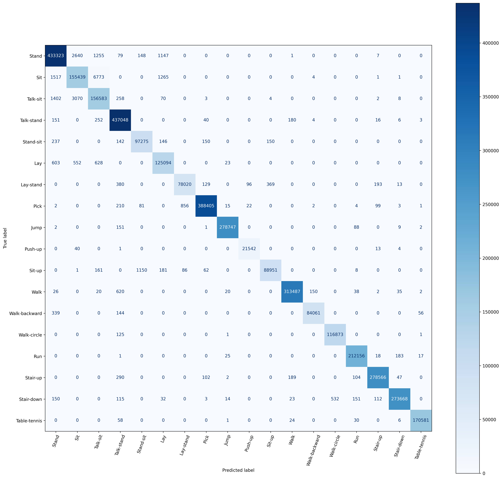
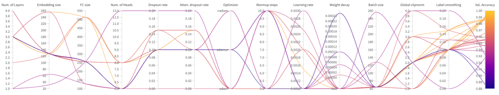

# HAR Transformer
Transformer for Human Activity Recognition

## Description

The Transformer for Human Activity Recognition operates in sequence-to-sequence mode and predicts the class for each time series feature. The advantage is that if there are several consecutive classes in one time series, these classes can be easily identified, and the transformer is not limited to the features in the whole time series belonging to one class. 

## Model

  

## Results

  <b>Confusion matrix</b>
  

  <b>Hyperparameters</b>
  

----------------------------------

**Frameworks:** TensorFlow, NumPy, Pandas, Scikit-learn, WanDB
